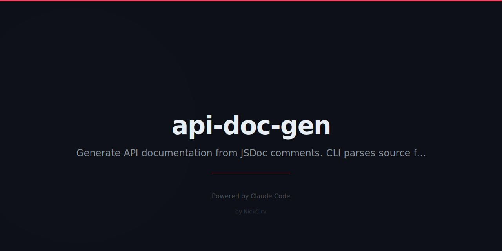

# api-doc-gen

Generate API documentation from JSDoc/TSDoc comments in JS/TS files. No TypeScript compiler, no build step, zero external dependencies.

```
adg ./src --format html --output docs/
```

## Features

- Scans `.js`, `.ts`, `.mjs`, `.cjs`, `.tsx`, `.jsx` files recursively
- Extracts `@param`, `@returns`, `@description`, `@example`, `@throws`, `@deprecated`, `@private`, `@since`, `@author`, `@version`
- Outputs **Markdown**, **HTML** (dark-themed, standalone), or **JSON**
- `--watch` mode with debounced regeneration
- `--private` flag to include `@private` tagged entries
- Output to stdout, file, or directory
- No `node_modules`, no config files, no compiler

## Install

```bash
npm install -g api-doc-gen
```

Or run without installing:

```bash
npx api-doc-gen ./src
```

## Usage

```
adg [file|dir] [options]
api-doc-gen [file|dir] [options]

OPTIONS
  --format, -f <format>   Output format: markdown (default), html, json
  --output, -o <path>     Output file or directory. Default: stdout
  --watch, -w             Watch for changes and regenerate
  --private               Include @private tagged entries
  --help, -h              Show this help message
  --version, -v           Show version
```

## Examples

```bash
# Markdown to stdout
adg ./src

# HTML docs to a directory
adg ./src --format html --output docs/

# JSON to a specific file
adg index.js --format json --output api.json

# Write Markdown, watch for changes
adg ./src --watch --output docs/api.md

# Include private APIs
adg ./src --private

# Generate docs from this tool's own source
adg index.js
```

## Supported JSDoc Tags

| Tag | Description |
|-----|-------------|
| `@description` | Function/class description (also parsed from block preamble) |
| `@param {type} name - desc` | Parameter with type and description |
| `@returns {type} - desc` | Return value |
| `@throws {ErrorType} - desc` | Thrown exceptions |
| `@example` | Code example (rendered as fenced code block) |
| `@deprecated` | Marks entry as deprecated |
| `@private` | Hidden unless `--private` flag used |
| `@since` | Version since available |
| `@author` | Author attribution |
| `@version` | Module/function version |

## Output Formats

### Markdown (default)

Clean GitHub-flavoured Markdown. Perfect for `README.md`, GitHub wiki, or any Markdown renderer.

### HTML

Self-contained single-file HTML with a dark theme. No external assets or CDN dependencies. Open directly in a browser.

### JSON

Structured JSON output for downstream tooling, CI pipelines, or custom renderers.

```json
{
  "generated": "2026-03-03T09:00:00.000Z",
  "generator": "api-doc-gen v1.0.0",
  "files": ["src/index.js"],
  "entries": [
    {
      "name": "parseArgs",
      "kind": "function",
      "description": "...",
      "params": [{ "name": "argv", "type": "string[]", "description": "..." }],
      "returns": { "type": "object", "description": "..." },
      "examples": [],
      "throws": [],
      "deprecated": null,
      "private": false
    }
  ]
}
```

## Requirements

- Node.js 18+
- Zero npm dependencies

## License

MIT
