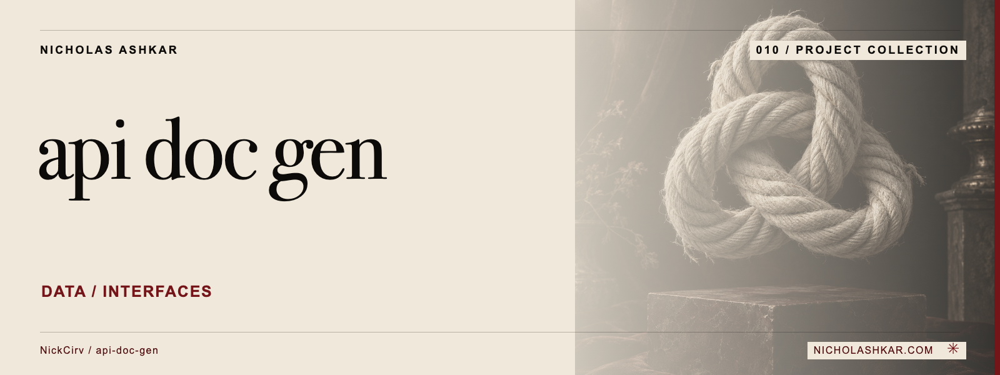

# api-doc-gen

Builds Markdown, HTML or JSON API documentation from JSDoc-style comments in JavaScript and TypeScript files.


<a id="usage"></a>

<a id="markdown-to-stdout-default"></a>

<a id="standalone-dark-themed-html"></a>

<a id="watch-mode--regenerates-on-save"></a>

## What it does

- File or directory input.
- Private-entry filtering.
- Output files/directories.
- Watch mode.


<a id="install"></a>

## Quickstart

Prerequisites: Node.js `>=18.0.0` and npm. The checkout below pins the source used for this documentation.

```sh
git clone https://github.com/NickCirv/api-doc-gen.git
cd api-doc-gen
git checkout 6b51088532813af53a4b642ac35a7529a0a12d7a
node index.js index.js --format markdown
```

**Expected behavior (illustrative, not captured):** Prints documentation extracted from comments in index.js.

Examples are source-inspected, **not runtime-tested**. See the research record for verification gaps.

## Boundaries and data

Parsing is based on source text and nearby declarations, not a TypeScript compiler. Generated docs can omit dynamic exports or complex syntax; review the result before publishing.


<a id="json-for-ci-pipelines-or-custom-renderers"></a>

## Development

The manifest defines `npm test` as:

```sh
node --test
```

The captured suite is a smoke check, not end-to-end behavior coverage. Examples include “entry is valid JavaScript”, “--help exits 0”. Tests were not run for this documentation revision.

See [implementation and command reference](docs/REFERENCE.md) for the package scripts and inspected interfaces, and [research record](docs/RESEARCH.md) for the pinned source, document decisions and unresolved checks.

## License and contact

See [LICENSE](LICENSE) for the original terms and attribution. Legal text is unchanged.

[Nicholas Ashkar](https://nicholashkar.com/) · [Discuss a project](https://nicholashkar.com/#oxblood-contact)
